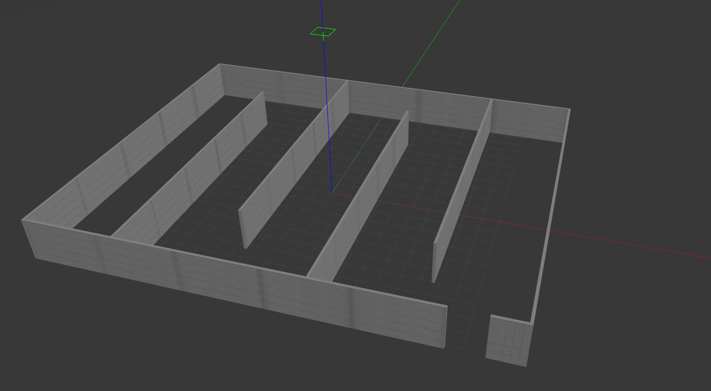
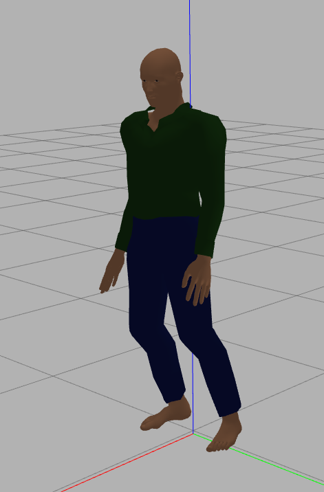

# Maskon

## Simulation

We thought to use turtlebot for simulation. It contains a lidar and we have mounted a camera to it. And we thought to simlate it in a mall-like environment like this

and bot looks like

we also thought to add human models like the below one

