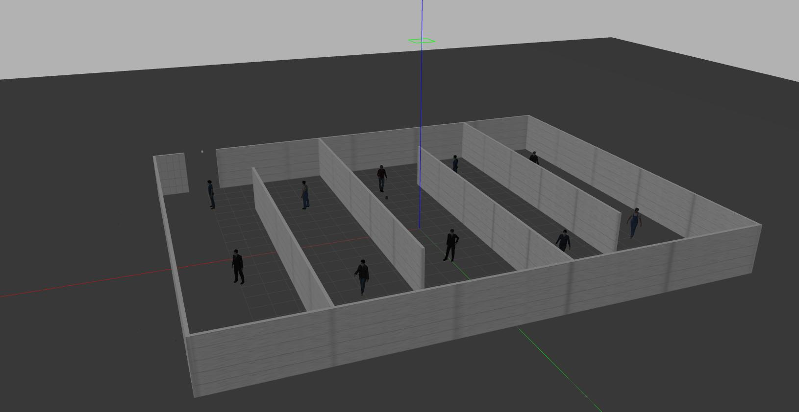
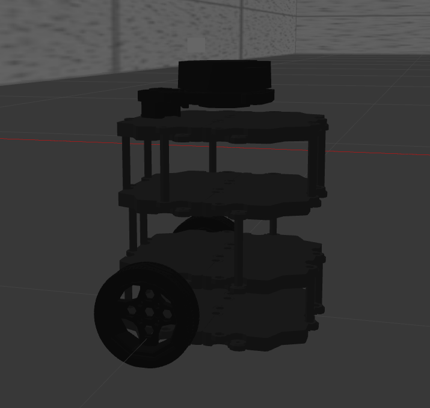
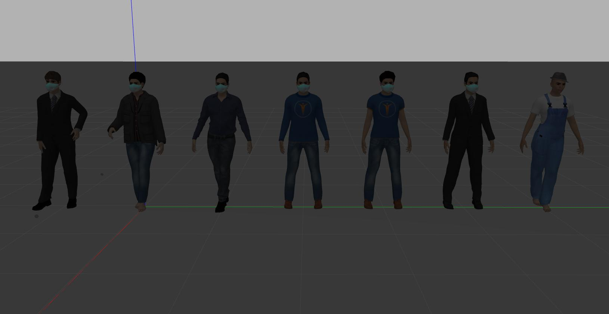

# Maskon

## Simulation

We are using gazebo to simulate a mall-like environment and [turtlebot](http://wiki.ros.org/turtlebot3) as surveillance bot. Turtlebot contains a lidar and we have mounted a camera on it. 

<i><small>Mall-like environment</small></i>

<i><small>Turtlebot</small></i>

we also use realistic human models with masks and without masks in mall

<i><small>Different Human Models</small></i>
</

