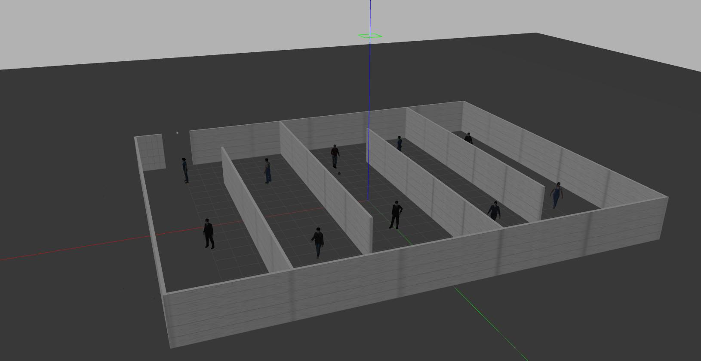
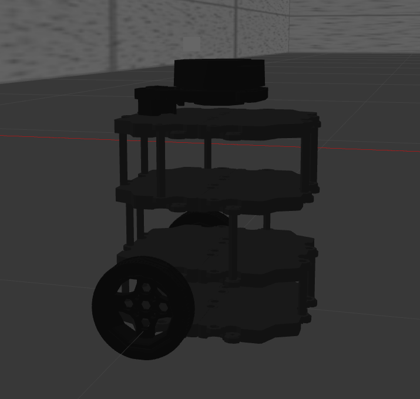
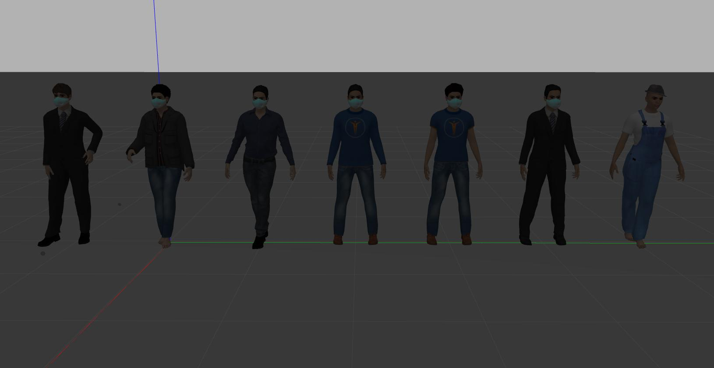
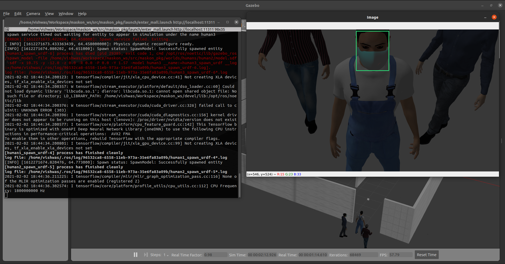
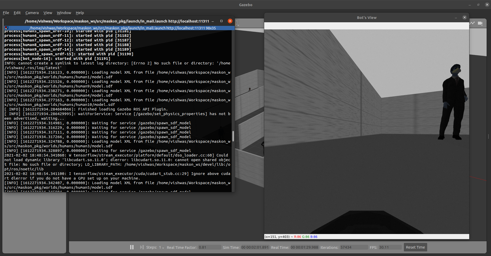

# Maskon
**Maskon** is a surveillance setup built as a ROS package for mall-like environments in the times like COVID-19. This was done under the **Robotics Research Group (RoboReG)**.  It includes checking people for the mask at the entrance and also a bot that roams in the mall checking people for the mask. 

  * [Environment](#Environment)
  * [Approach](#Approach)
  * [Installation](#Installation)
  * [Usage](#Usage)
  * [Results](#Results)
  * [Team](#Team)

## Environment

We used the Gazebo simulator to simulate a mall-like environment and created different realistic human models using [Make Human](http://www.makehumancommunity.org/) software with and without a mask. And we used [turtlebot](http://wiki.ros.org/turtlebot3) as our surveillance bot. Turtlebot contains a lidar mounted on it and we have mounted a camera on it. 

<div align="center"><p><i>Mall-like environment</i></p><p><i>Turtlebot</i></p><p><i>Different Human Models</i></p></div>

## Approach

We have two different scenes here:

* **Entrance checking node :** We will have a camera at the entrance of the mall. So for every frame, we have detected faces in that frame using the [MTCNN](https://pypi.org/project/mtcnn/) library then classify those faces whether it has a mask on it or not using a **CNN** model which we trained on a dataset that contains faces with and without masks.
* **Bot node :** The bot *roams* inside the mall by avoiding obstacles using the data from the lidar sensor mounted on it. We will have a camera on the bot. So for every frame, we have extracted human poses using the [posenet](https://github.com/rwightman/posenet-python) library then extracted human faces from the pose information. And then classify those faces whether it has a mask on it or not using a **CNN** model which we trained on a dataset that contains faces with and without masks. 

## Installation

1. Firstly install ROS-Neotic, you can follow the instructions from the official [website](http://wiki.ros.org/noetic/Installation/Ubuntu#Installation).

2. Install catkin tools for python3

   ```shell
   sudo apt install python3-catkin-tools
   ```

3. Create a catkin workspace if you don't have one

   ```shell
   mkdir -p ~/maskon_ws/src
   cd ~/maskon_ws
   catkin init
   catkin_make
   ```

   then the `devel/setup.bash` file of your workspace must be sourced every time when you want to use ROS packages created inside this workspace.

   ```shell
   gedit ~/.bashrc
   # Add the below line in the .bashrc script
   source ~/maskon_ws/devel/setup.bash
   ```

4. As this package depends on turtlebot3 you need to clone turtlebot3 packages  into the `maskon_ws/src` directory

   ```shell
   cd ~/maskon_ws/src
   git clone https://github.com/ROBOTIS-GIT/turtlebot3.git
   git clone https://github.com/ROBOTIS-GIT/turtlebot3_msgs.git
   git clone https://github.com/ROBOTIS-GIT/turtlebot3_simulations.git
   cd ~/maskon_ws 
   catkin_make
   ```

5. Clone this repository into the `maskon_ws/src` directory

   ```shell
   cd ~/maskon_ws/src
   git clone https://github.com/Robotics-Club-IIT-BHU/Maskon.git
   cd ~/maskon_ws 
   catkin_make
   ```

6. We need to download `worlds` directory as we didn't include it in this repository due to its size

   ```shell
   cd ~/maskon_ws/src/Maskon
   wget https://github.com/Robotics-Club-IIT-BHU/Maskon/releases/download/v1.0/worlds.zip
   unzip worlds.zip
   ```
   
7. Install required python libraries 

   ```shell
   cd ~/maskon_ws/src/Maskon
   pip3 install -r requirements.txt 
   ```

## Usage

There are two launch files for [entrance check](launch/enter_mall.launch) and [inside mall](launch/in_mall.launch):

1. Now launch `enter_mall.launch` file

   ```shell
   roslaunch Maskon enter_mall.launch
   ```

   you can see the gazebo window and Image window pops up as shown

   <div align="center"></div>

2. Now launch `in_mal.launch` file

   ```shell
   roslaunch Maskon in_mall.launch
   ```

   you can see the gazebo window and Bot's View window pops up as shown

<div align="center"></div>

## Results

| <div align="center"></div>    | <div align="center"></div>  |
| ------------------------------------------------------------ | ------------------------------------------------------------ |
| <div align="center">You can see a person without mask and it draws a red box around his face</div> | <div align="center">You can see a person with mask and it draws a green box around his face</div> |


## Team ✨

Thanks goes to these wonderful people ([emoji key](https://allcontributors.org/docs/en/emoji-key)):
<!-- ALL-CONTRIBUTORS-LIST:START - Do not remove or modify this section -->
<!-- prettier-ignore-start -->
<!-- markdownlint-disable -->
#### Makers
<table>	
  <tr>	  
    <td align="center"><a href="https://github.com/ananya130"><br /><sub><b>Ananya Singh</b></sub></a><br /><a href="https://github.com/Robotics-Club-IIT-BHU/Maskon/commits?author=ananya130" title="Code">💻</a> <a href="#ideas-ananya130" title="Ideas, Planning, & Feedback">🤔</a></td>	    
    <td align="center"><a href="https://github.com/jatin1604"><br /><sub><b>JATIN EAGA</b></sub></a><br /><a href="https://github.com/Robotics-Club-IIT-BHU/Maskon/commits?author=jatin1604" title="Code">💻</a> <a href="#ideas-jatin1604" title="Ideas, Planning, & Feedback">🤔</a></td>	 
	<td align="center"><a href="https://vstark21.github.io/website/"><br /><sub><b>V I S H W A S</b></sub></a><br /><a href="https://github.com/Robotics-Club-IIT-BHU/Maskon/commits?author=vstark21" title="Code">💻</a> <a href="#design-vstark21" title="Design">🎨</a></td>	
    <td align="center"><a href="https://github.com/payal116"><br /><sub><b>payal116</b></sub></a><br /><a href="https://github.com/Robotics-Club-IIT-BHU/Maskon/commits?author=payal116" title="Code">💻</a> <a href="#ideas-payal116" title="Ideas, Planning, & Feedback">🤔</a></td>	
  </tr>
</table>

#### Mentors
<table>
<tr>
    <td align="center"><a href="https://github.com/lok-i"><br /><sub><b>Lokesh Krishna</b></sub></a><br /><a href="#mentoring-lok-i" title="Mentoring">🧑‍🏫</a> <a href="#ideas-lok-i" title="Ideas, Planning, & Feedback">🤔</a></td>
    <td align="center"><a href="https://www.linkedin.com/in/niranth-sai-35386b179/"><br /><sub><b>Niranth Sai</b></sub></a><br /><a href="#mentoring-NiranthS" title="Mentoring">🧑‍🏫</a> <a href="#ideas-NiranthS" title="Ideas, Planning, & Feedback">🤔</a></td>
  </tr>
</table>
<!-- markdownlint-restore -->
<!-- prettier-ignore-end -->

<!-- ALL-CONTRIBUTORS-LIST:END -->

This project follows the [all-contributors](https://github.com/all-contributors/all-contributors) specification. Contributions of any kind welcome!
